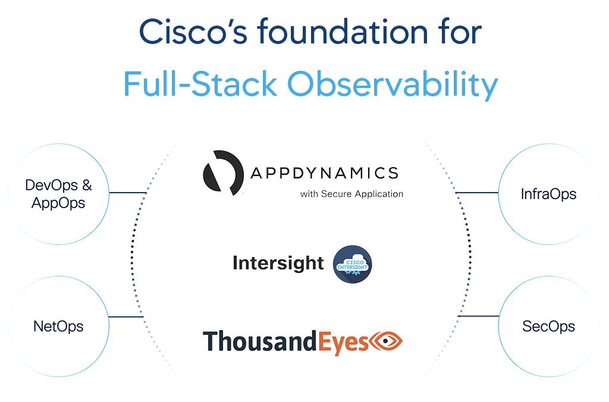

# FSO Lab DevOps

Welcome to the Cisco Full Stack Observability (FSO) series of workshops! These workshops will introduce 
lab participants to Cisco’s Full Stack Observability solution and the foundational components of that 
solution: AppDynamics, ThousandEyes, and Intersight.

In this series of workshops, lab participants will play a few different roles within an online global tea 
retailer. This retailer has been on the forefront of their niche industry. However, they have been running 
into some issues as of late during a major technical project. Throughout these workshops, participants will 
assume the identities of various technical leads as they implement aspects of the company’s full stack 
observability initiative.

## Learning Objectives

-	Understand Cisco’s vision around full stack observability and use cases addressed by each of the components.
-	Gain firsthand experience in developing aspects of the full stack ovservability solution for our retail company.
-	Learn how to translate concepts and ideas from the lab exercises to be utilized for your clients and customers.

## Workshop Overview

To facilitate these workshops, the FSO Lab DevOps project consists of a collection of build, deploy, and 
provisioning assets; sample application; lab guides; and instructions to aid in the delivery of the workshop.  

Customers, partners, and sellers are free to leverage these materials and gain valuable hands-on experience 
with Cisco's Full Stack Observability solutions.

## Workshop Delivery Approach

Infrastructure as Code (IaC) is the managing and provisioning of infrastructure through code instead of 
through manual processes. With IaC, configuration files are created that contain your infrastructure 
specifications, which makes it easier to edit and distribute configurations. It also ensures that you 
provision the same environment every time.  

Immutable infrastructure is an approach to managing services and deployments of IT resources (applications 
and infrastructure) where components are replaced rather than changed. This capability is deemed absolutely 
critical to support reproducibility and scale.  

This workshop leverages these two approaches by automating the build and deployment of workshop public cloud 
and on-prem resources.

## Get Started

To get started, Cisco SEs, AppDynamics SEs, partners, or others tasked with delivering the Workshop need 
to build and deploy the necessary cloud and on-prem resources required for each provider:

**NOTE:** Lab participants should skip this link.

-	[Build Steps for Preparing the Workshop](docs/BUILD_STEPS_FOR_PREPARING_THE_WORKSHOP.md)

## Workshop Lab Guides

Once the cloud environment is prepared, click on the following link to get started with the workshop:

-	[Cisco Full Stack Observability - Home](https://www.fsolabs.net/)

### Use Cases

This workshop series is divided into three sections: Performance, Optimization, and Security. Within each 
of these sections, there will be one or more use cases to be addressed by Cisco’s Full Stack Observability 
solution. Each section will introduce the lab participant to the relevant members of the organization they 
will be working with. They will dive deeper into the pain points each person is dealing with along with why 
he/she ultimately endorsed Cisco as the full stack observability solution provider of choice. In addition 
to understanding the value each person sees in the solution, participants will gain hands-on experience in 
solving business problems covered by the outlined use cases.  

Click on one of the following link to get started exploring the workshop use cases within each section:

-	[FSO Performance](https://performance.fsolabs.net/)
-	[FSO Optimization](https://optimization.fsolabs.net/)
-	[FSO Security](https://security.fsolabs.net/)
